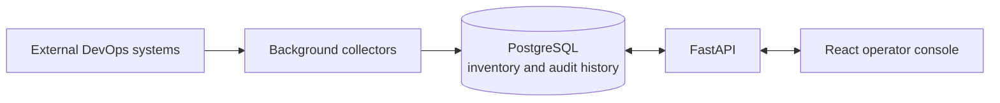

# Spaghetti Desk

> **Know what is running. Know who owns it. Know what needs attention.**

[](https://github.com/iMilad/spaghetti-desk/releases)
[](https://github.com/iMilad/spaghetti-desk/actions/workflows/ci.yml)
[](LICENSE)
[](backend/pyproject.toml)
[](frontend/package.json)

**Spaghetti Desk is an open-source DevOps control center for the operational
facts scattered across your stack.** It brings services, virtual machines,
pipelines, ownership, expiries, permissions, agent activity, collectors, and
audited actions into one fast, searchable workspace.

Most internal portals become slow because every screen calls every external
tool. Spaghetti Desk takes a different approach: background collectors
normalize data into a local PostgreSQL inventory, and the operator console
reads that local state. Pages stay responsive, integrations stay optional, and
the system remains useful even when an external tool is unavailable.

## Stop Hunting, Start Operating

Operational answers are often split across CI servers, VM platforms,
spreadsheets, ticket systems, monitoring tools, and individual memory.
Spaghetti Desk is designed to answer the questions that cross those boundaries:

- What services and pipelines are running, and are they healthy?
- Which VMs have unknown, stale, or disputed ownership?
- What licenses, certificates, support contracts, or tokens expire next?
- Where do risky, stale, or inconsistent permissions exist?
- What did an operator, collector, or coding agent do recently?
- Which action requests are waiting for approval, and what evidence was kept?

## What You Get

| Surface | What it gives an operator |
| --- | --- |
| **Overview** | Service health, VM ownership gaps, renewal pressure, permission risk, agent activity, action state, and an attention queue |
| **Services** | A searchable catalog of owners, runtime location, maintenance state, monitoring state, and known risks |
| **Pipelines** | Repository, CI job, artifact, target, owner, status, and last-run visibility |
| **VMs** | Ownership confidence, environment, purpose, capacity, patch state, freshness, and review status |
| **Licenses** | Renewal and expiry tracking for licenses, support, certificates, service accounts, and tokens |
| **Permissions** | Admin access, stale accounts, service accounts, drift, and review findings across systems |
| **Agents** | Session history, commands, approvals, files changed, outcomes, and supporting links |
| **Audit** | Sanitized action requests, approval decisions, execution state, before/after evidence, and result history |
| **Collectors** | Installed, enabled, configured, and last-run status for every collector plugin |

Deployments can enable only the modules they need and choose which widgets
appear on the overview. Navigation and overview composition are served by the
backend, so the UI follows deployment configuration instead of hard-coded
assumptions.

## Built for Real Operations

- **Fast by architecture.** Normal page loads read the local inventory instead
  of proxying several external APIs.
- **Extensible by design.** Collector plugins connect specific tools while the
  core owns normalized models, APIs, scheduling, and run history.
- **Approval-aware.** Action requests are recorded and sanitized before a
  future runner is allowed to mutate an external system.
- **Observable.** Collector runs, agent sessions, requests, decisions, and
  outcomes remain visible as operational history.
- **Safe to evaluate.** The default deployment uses synthetic demo data,
  disables real integrations, and makes no external collector calls.
- **Public/private by construction.** Source and examples stay public-safe;
  real URLs, credentials, mappings, and inventory remain in private deployment
  configuration.

## Run It Locally

You need Docker with Docker Compose. Then run:

```bash
docker compose up --build
```

The Compose stack starts PostgreSQL, applies Alembic migrations, launches the
FastAPI backend, and serves the React frontend.

| Open | URL |
| --- | --- |
| Operator console | [http://localhost:5173](http://localhost:5173) |
| API documentation | [http://localhost:8000/docs](http://localhost:8000/docs) |
| Backend health | [http://localhost:8000/healthz](http://localhost:8000/healthz) |
| PostgreSQL | `localhost:5432` |

The first run is a self-contained demo. No Jenkins server, cloud account,
company inventory, or credentials are required.

### Run a Published Release

Each GitHub release includes a digest-pinned Compose file and a matching
environment template. Download both assets, set a private PostgreSQL password,
and start the application:

```bash
cp spaghetti-desk-vX.Y.Z.env.example .env
# Set POSTGRES_PASSWORD in .env before continuing.
docker compose \
  --env-file .env \
  --file spaghetti-desk-vX.Y.Z-compose.yaml \
  up --detach
```

The release deployment serves the compiled frontend and API together at
`http://localhost:8080`, keeps PostgreSQL off the host network, and runs
database migrations before starting the application. See
[Container releases](docs/container-release.md) for verification, upgrades,
private configuration, and maintainer setup.

## Architecture



The core runtime follows four rules:

1. Collect external data in the background.
2. Normalize it into stable local models.
3. Keep page reads local, paginated, and filterable.
4. Record mutating intent before controlled execution.

The current action layer implements local request, approval, rejection, and
audit state. It deliberately does **not** execute scripts or change external
systems yet.

## Add Your Systems

Collector plugins are optional Python packages discovered through the
`spaghetti_desk.collectors` entry-point group. The repository includes an
optional Jenkins collector, while public defaults keep every external
integration disabled.

Run the local installer once:

```bash
scripts/install-local.py
```

It safely creates the private configuration, credential environment, and Docker
override files. Existing configuration and credentials are never overwritten.
Start the stack with the exact command printed by the installer:

```console
docker compose \
  --env-file ~/.config/spaghetti-desk/compose.env \
  --file docker-compose.yml \
  --file ~/.config/spaghetti-desk/docker-compose.user.yml \
  up --build
```

Open **Settings** in the app to configure the operator and Jenkins integration,
test connectivity, and save. Non-secret values are written atomically to
`config.yaml`; credentials are masked in the UI and written separately to the
private `compose.env`. Every settings change is recorded in the audit log. The
development backend image already includes the Jenkins collector plugin.

Create a new collector package from the project scaffold:

```bash
scripts/scaffold-collector example-ci
```

For a backend running directly on the host, install the included Jenkins plugin
into that Python environment:

```bash
cd backend
uv pip install -e ../plugins/jenkins
```

The Settings UI is the normal configuration path. The generated files remain
available for backup and advanced deployment automation, but must never be
committed.

See [private configuration](docs/private-configuration.md), the
[collector framework](docs/collectors.md), and the
[collector plugin template](docs/collector-plugin-template.md) for the runtime
contract and a complete example.

## Project Status

Spaghetti Desk `v0.2.0` is an early, working foundation intended for local
evaluation and extension.

Already implemented:

- A responsive operator console with overview and dedicated catalog views
- FastAPI APIs with filtering, pagination, configuration, and local demo data
- PostgreSQL persistence, SQLAlchemy repositories, and Alembic migrations
- Backend-configured modules, navigation, and overview widgets
- APScheduler collector runtime, entry-point plugin discovery, and run history
- Optional Jenkins pipeline collection into the local read model
- Action request, approval, rejection, sanitization, and audit workflows
- A combined multi-platform release image and digest-pinned Compose deployment
- Backend and frontend tests, CI, release automation, and secret scanning

Deliberately next:

- Production authentication and role enforcement
- More collectors and importers for VM, source, artifact, and identity systems
- A controlled action runner for approved operations
- Ownership review and expiry notification workflows
- Broader production hardening and deployment guidance

It is not yet a replacement for an identity provider, monitoring platform, or
production change-management system. It is the inventory and control layer that
connects their operational context.

## Development

Backend setup:

```bash
cd backend
uv sync --all-extras --dev
uv run alembic upgrade head
uv run uvicorn app.main:app --reload
```

Backend checks:

```bash
cd backend
uv run ruff check .
uv run pytest
```

Frontend setup:

```bash
cd frontend
npm ci
npm run dev
```

Frontend checks:

```bash
cd frontend
npm run typecheck
npm test
npm run build
```

When `VITE_API_BASE_URL` is unset, the Vite development server proxies
`/api` and `/healthz` to `http://127.0.0.1:8000`.

## Documentation

| Guide | Focus |
| --- | --- |
| [Architecture](docs/architecture.md) | Runtime boundaries and data flow |
| [Modules](docs/modules.md) | Deployment-controlled navigation and widgets |
| [Persistence](docs/persistence.md) | Database models, repositories, and migrations |
| [Private configuration](docs/private-configuration.md) | Company overrides, secrets, and local Compose setup |
| [Collectors](docs/collectors.md) | Plugin discovery, scheduling, and local writes |
| [Action and audit](docs/action-audit.md) | Requests, decisions, sanitization, and evidence |
| [Container releases](docs/container-release.md) | Docker Hub images, Compose deployment, and release setup |
| [Data boundaries](docs/data-boundaries.md) | Public source versus private deployment data |
| [Contributing](CONTRIBUTING.md) | Development principles and contribution workflow |

## Security and Data Safety

Spaghetti Desk is intended to remain safe as a public repository. Use fake
data in source, tests, examples, screenshots, and documentation. Keep real
hostnames, IP addresses, URLs, identities, credentials, license details, and
inventory exports outside the repository.

Run the local public-safety check before opening a pull request:

```bash
./scripts/security-check.sh
```

Report vulnerabilities through the process in [SECURITY.md](SECURITY.md).

## Releases

The project uses [Semantic Versioning](https://semver.org/) and Conventional
Commits. Maintainers publish from `main` with the manual **Publish Release**
workflow. It creates the version tag and GitHub release, publishes the
multi-platform Docker Hub image, and attaches a digest-pinned Compose file,
environment template, and SHA-256 checksums.

See [CHANGELOG.md](CHANGELOG.md) and the
[GitHub releases](https://github.com/iMilad/spaghetti-desk/releases) for
published changes.

## License

Spaghetti Desk is available under the [MIT License](LICENSE).
